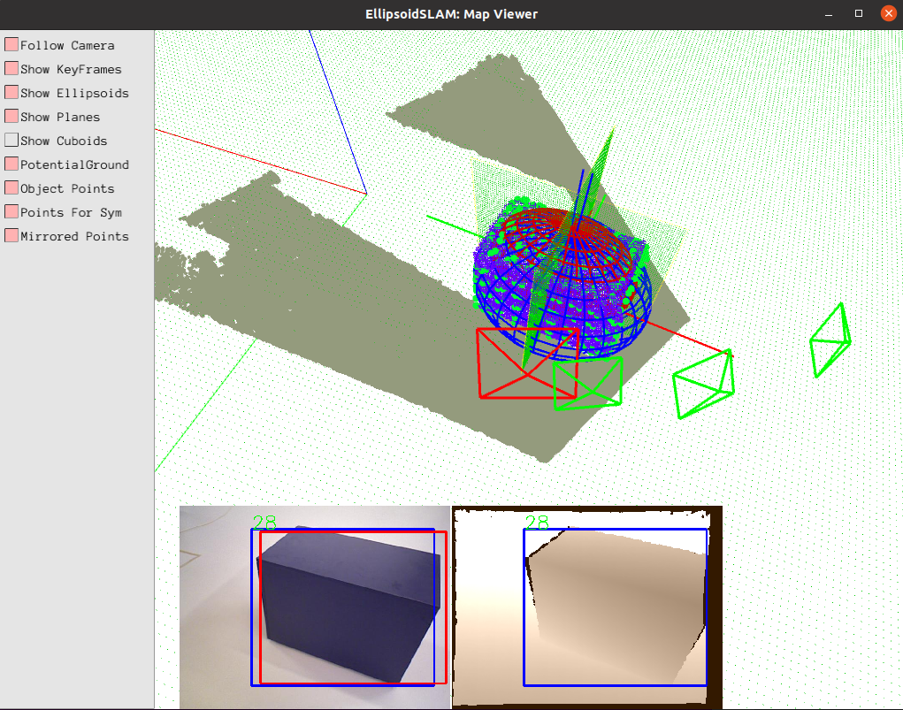

# EllipsoidSLAM

## Update
### Aug 22, 2021
* Now support Ubuntu 20.04 and OpenCV 4.2
* Fix bugs for crushes

## Introduction

We propose a sparse object-level SLAM using Quadrics and Symmetry Properties for indoor environments. The algorithm is specially designed for mobile robots mounting an RGB-D camera. The algorithm takes bounding boxes generated from object detection and also the point cloud from the RGB-D frame to estimate the pose and occupy space of objects. Since ellipsoids are taken as the object representation, we name it EllipsoidSLAM.

We have released a C++ implementation and a demo trajectory. We need to point out that this code is only a basic demo:
 * The core modules of Groundplane Extraction, Ellipsoid Estimation, and Symmetry Estimation are basic versions. They may not have full performance. Please see the paper for the complete framework. 
 * By default, only mapping is supported. If you want, it's possible to make simple changes to the Optimizer to enable the SLAM mode.

## Author

Ziwei Liao et al., Robotics Institute, School of Mechanical Engineering & Automation, Beihang University, Beijing, China (Email: liaoziwei@buaa.edu.cn)

## Related Paper
Please cite the following papers when you found this code useful for your research. Welcome to read our new paper [2], which proposes two RGB-D observation models for quadrics, and introduces an automatic data association method.

[1] Ziwei Liao, Wei Wang, Xianyu Qi, Xiaoyu Zhang, Lin Xue, Jianzhen Jiao, Ran Wei, Object-oriented SLAM using Quadrics and Symmetry Properties for Indoor Environments. arXiv 2020. [[pdf]](https://arxiv.org/abs/2004.05303
) [[Video]](https://www.youtube.com/watch?v=u9zRBp4TPIs
) 

[2] Liao, Z.; Wang, W.; Qi, X.; Zhang, X. RGB-D Object SLAM Using Quadrics for Indoor Environments. Sensors 2020, 20, 5150. [[pdf]](https://www.mdpi.com/1424-8220/20/18/5150/pdf)

## Codes
### Dependencies
The code has been tested on Ubuntu 16.04/18.04. The main dependencies are:

* OpenCV (4.X recommended)
* PCL 1.7+
* Pangolin
* g2o

For g2o, a modified version with SE3 transformation has been attached in the code. Use one simple command to compile it:
    
    $ sh install_g2o.sh

### Build
These commands will automatically generate the Core module and an interface for RGB-D dataset:

    $ mkdir build
    $ cd build
    $ cmake .. 
    $ make -j

if there occurs a linking problem, add the lib directory to the environment variable:

    export LD_LIBRARY_PATH={YOUR_SOUCE_CODE_PATH}/lib:$LD_LIBRARY_PATH

## Demos

### TUM-Cabinet
The codes contain a trajectory of fr3_cabinet, which belongs to the TUM-RGB-D dataset. The bounding boxes are generated by YOLO. Just use one command to run the demo:

#### Run
    ./build/rgbd ./Example/param/TUM3.yaml ./Example/dataset/cabinet/

Please press Enter in the console to see the result of every frame. A visualization tool based on Pangolin is offered to visualize the point cloud, the symmetry planes, the ground plane, and the ellipsoids.

### Your Own Dataset
First, please run object detector like YOLO to generate bounding boxes and store the result as text files, with each line containing:

* id x1 y1 x2 y2 label probability instance

where, (x1,y1), (x2,y2) are the top-left, bottom-right corners. Multiple objects are supported, however, you need to manually specify the data association in [instance]. 

Second, keep the directory structure the same as the demo, then run the RGB-D interface. For the best effect, you may need to check the ground plane extraction and the point cloud segmentation.

## Notes
* All the important parameters could be adjusted in the .yaml file. See the comments in the file for details.

* The code is released under the BSD license. Feel free to adjust it as you like for research. Please cite our paper in your publications if you feel it helpful. 

* The code referred to several open-source SLAM codes, thanks to their great work: [ORBSLAM](https://github.com/raulmur/ORB_SLAM2), [CubeSLAM](https://github.com/shichaoy/cube_slam). 

* If you have any further questions, feel free to contact the author: liaoziwei{at}buaa.edu.cn
